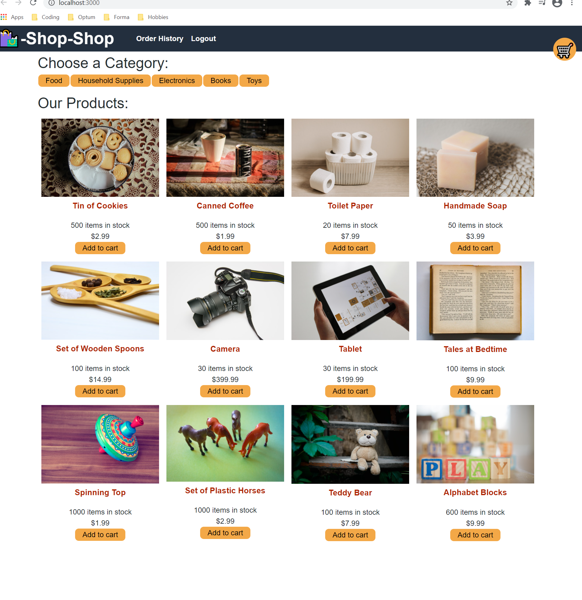

# week-22-hw (Redux Store)

## Description

This project is to become familiar with React Redux.  This is compared by Redux using a Default State versus a Global State.

## Table of Contents
* [Installation](#installation)
* [Questions](#questions)

## Installation

After cloning, use npm install to install dependencies.  After install is complete, use npm start in your command line to launch the Redux Store.

## Screenshot

## Questions  

Feel free to checkout my other projects https://github.com/nrhuizar
Or you can reach me @ nrhuizar@gmail.com
